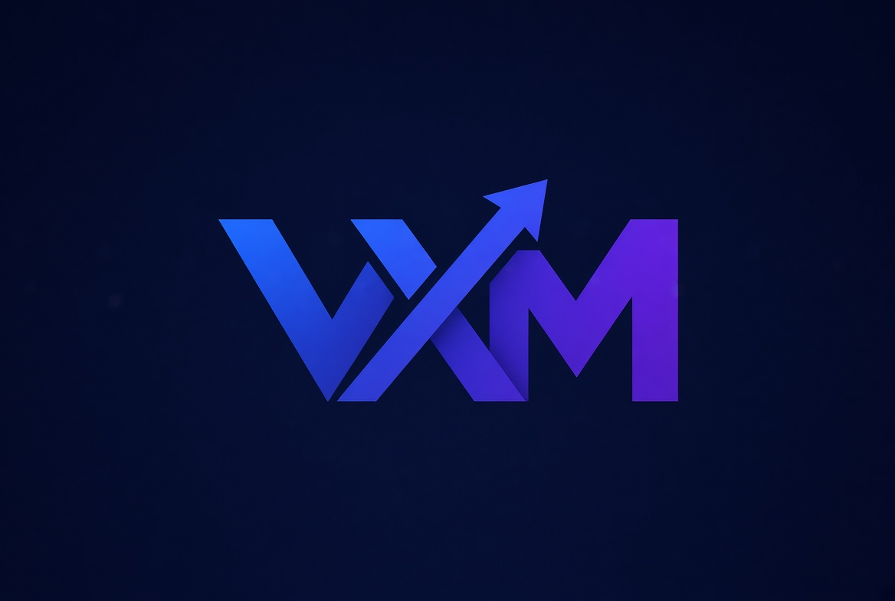
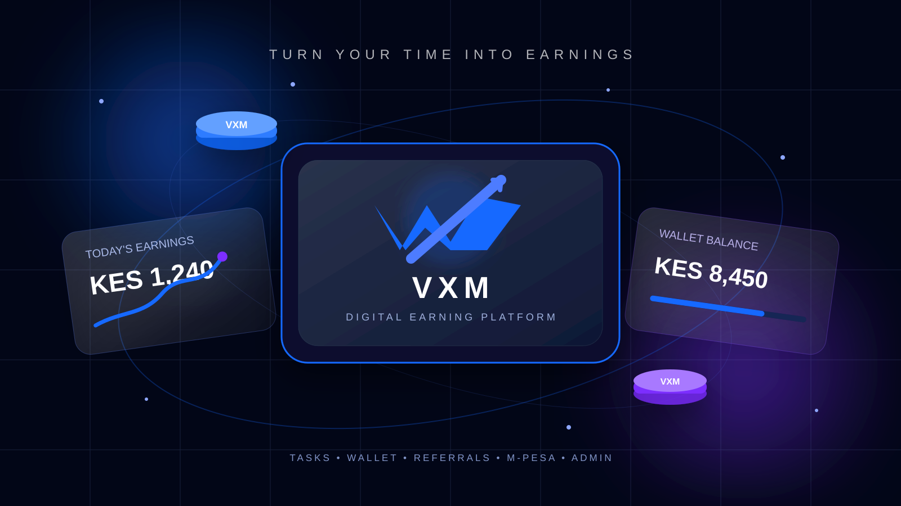
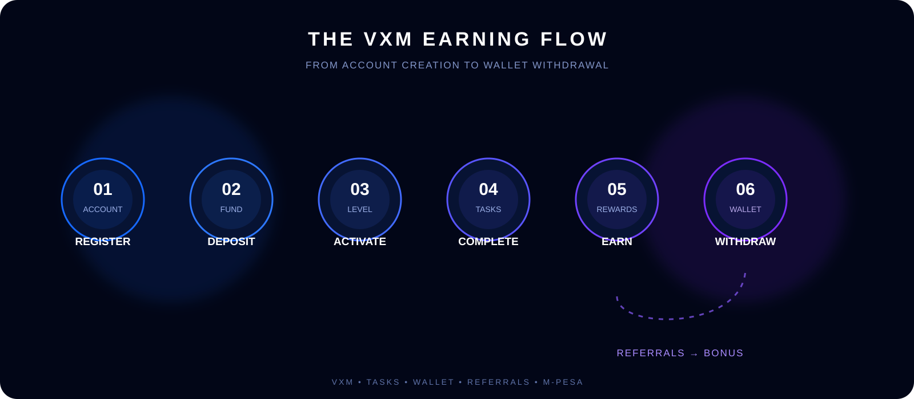
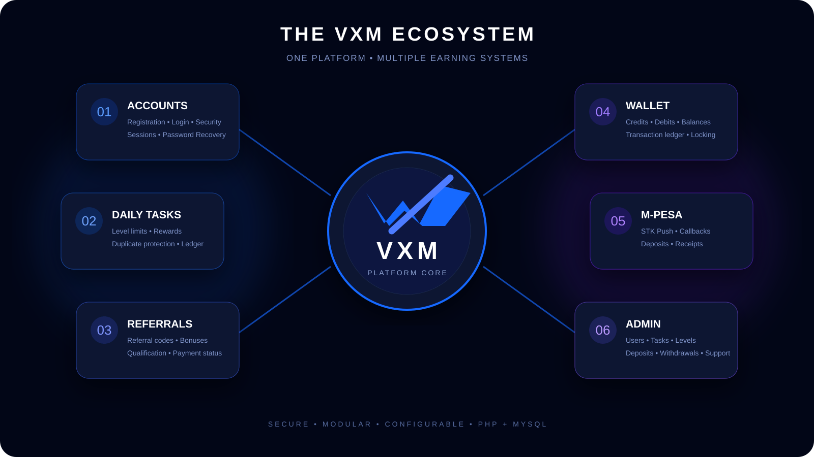

<div align="center">



# VXM

### TURN YOUR TIME INTO EARNINGS

**A futuristic digital earning platform built with PHP, MySQL, JavaScript, Bootstrap & M-Pesa integration.**

<br>

<a href="https://samsonnyaga474.github.io/VXM/">

</a>

<a href="#-how-vxm-works">

</a>

<br><br>



</div>

---

# ⚡ What is VXM?

**VXM** is a full-stack digital earning platform designed around a simple concept:

> **Join → Choose a Level → Complete Tasks → Earn → Refer → Withdraw**

The platform provides users with a dashboard where they can manage their account, participate in daily tasks, track earnings, manage their wallet, view transactions, refer other users and request withdrawals.

VXM combines a modern futuristic interface with a PHP/MySQL backend and an M-Pesa payment foundation.

---

# 🌌 The VXM Experience

<div align="center">



</div>

### The journey

| Stage | What happens |
|---|---|
| **01 — Register** | Create a VXM account |
| **02 — Join Level** | Select an available earning level |
| **03 — Complete Tasks** | Complete eligible daily tasks |
| **04 — Earn** | Receive task and referral rewards |
| **05 — Refer** | Invite other users |
| **06 — Withdraw** | Request withdrawal from available balance |

---

# 🧠 How VXM Works

<div align="center">



</div>

## 👤 User System

Users can:

- Register and log in
- Select an earning level
- Access daily tasks
- Complete eligible tasks
- Track earnings
- View wallet balance
- View transaction history
- Manage referrals
- Receive notifications
- Contact support
- Request withdrawals
- Reset forgotten passwords

---

## 💰 Earning System

VXM supports several earning mechanisms.

### Task Rewards

Users receive rewards when eligible tasks are successfully completed.

The system prevents duplicate task completion and enforces daily task limits.

### Referral Rewards

Users can invite others through their referral link.

Referral rewards are triggered according to the configured platform rules.

### Wallet

The wallet system maintains:

- Current balance
- Total earnings
- Total deposits
- Total withdrawals
- Transaction history

Financial operations use database transactions and row locking to help protect wallet consistency.

---

# 💳 M-Pesa Integration

VXM includes an integration foundation for **Safaricom M-Pesa Daraja**.

The system supports:

- STK Push initiation
- Sandbox configuration
- Production configuration through environment variables
- Callback processing
- Payment status handling
- Duplicate callback protection
- Automatic wallet crediting after confirmed payment

The M-Pesa implementation is designed so payment credentials are stored through environment configuration rather than committed into the repository.

---

# 🛡️ Security

Security is built into the application architecture.

VXM includes:

- CSRF protection
- Secure sessions
- Password hashing
- Login rate limiting
- Account lockout protection
- Authentication guards
- Admin authorization
- Input validation
- Output escaping
- Database transactions
- Wallet row locking
- Duplicate transaction protection
- Environment-based configuration

Sensitive configuration such as database credentials and payment credentials should remain inside `.env`.

---

# 🏗️ Technology Stack

<div align="center">


</div>

---

# 📂 Project Architecture

```text
VXM/
│
├── admin/
│   ├── _layout.php
│   ├── deposits.php
│   ├── index.php
│   ├── levels.php
│   ├── referrals.php
│   ├── support.php
│   ├── tasks.php
│   ├── transactions.php
│   ├── users.php
│   └── withdrawals.php
│
├── api/
│   └── deposit.php
│
├── config/
│   └── config.php
│
├── database/
│   └── vxm_setup.sql
│
├── includes/
│   ├── bootstrap.php
│   ├── db.php
│   ├── helpers.php
│   ├── layout_user.php
│   ├── Mail.php
│   ├── Mpesa.php
│   └── Wallet.php
│
├── migrations/
│   ├── 001_schema.sql
│   └── 002_integrity_constraints.sql
│
├── mpesa/
│   └── callback.php
│
├── readme-assets/
│   ├── hero/
│   ├── screenshots/
│   ├── diagrams/
│   └── icons/
│
├── storage/
│
├── account.php
├── approve-withdrawal.php
├── complete-task.php
├── dashboard.php
├── deposit.php
├── levels.php
├── notifications.php
├── referrals.php
├── support.php
├── tasks.php
├── transactions.php
├── withdraw.php
│
├── index.html
├── login.php
├── register.php
├── logout.php
│
├── .env.example
├── .gitignore
├── .htaccess
└── README.md